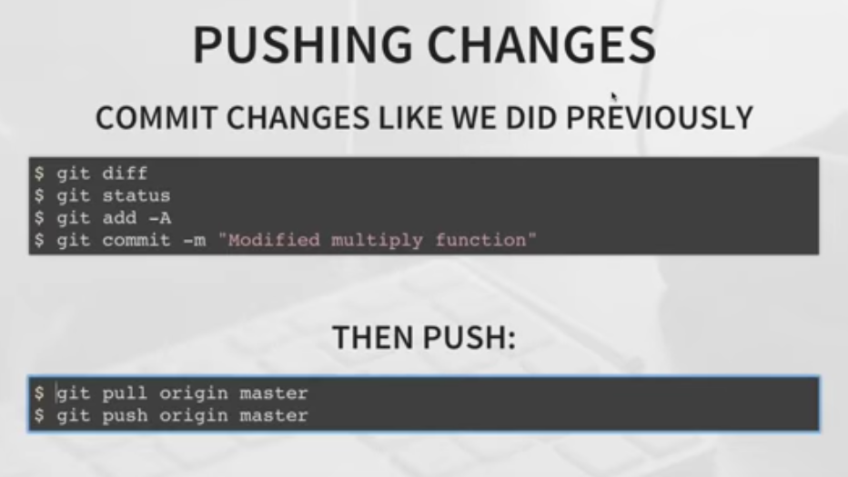
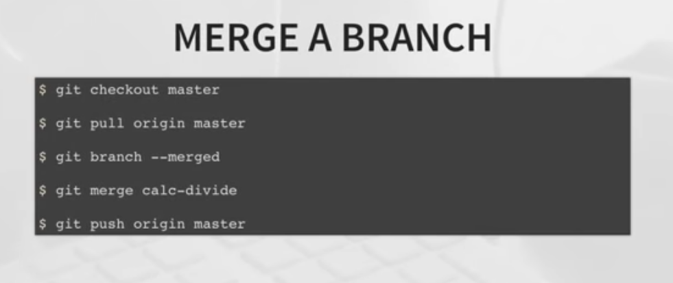
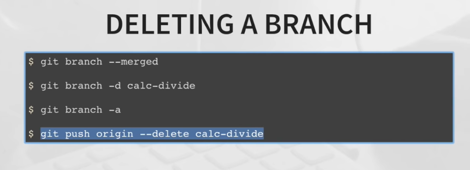

# Notes for Git

**origin** is not special

Just like the branch name “master” does not have any special meaning in Git, neither does “origin”. While “master” is the default name for a starting branch when you run git init which is the only reason it’s widely used, “origin” is the default name for a remote when you run git clone. If you run git clone -o booyah instead, then you will have booyah/master as your default remote branch.

## create a new repository on the command line
* echo "# First-Angular-Project" >> README.md
* git init
* git add README.md
* git commit -m "first commit"
* git remote add origin https://github.com/jai1408/First-Angular-Project.git
* git push -u origin master

## push an existing repository from the command line
* git remote add origin https://github.com/jai1408/First-Angular-Project.git
* git push -u origin master

## Basic GIT commands
* git --version
* git config --global user.name "jai1408"
* git config --global user.email "jaishankarmishra17@gmail.com"
* git config --list
* git help verb/config
* git init
* git remote update origin --prune **For updating remote branches**
* git branch -d feature/directives **For deleting any branch**
* git branch **show local branch**
* git branch -a **show all branch**
* git branch -r **show remote branch**

***

***

***

***

***

